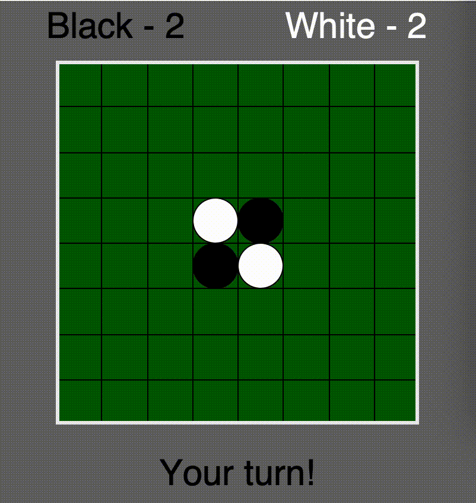

# Description

The goal of this project was to create the board game of Othello complete with artificial intelligence capable of beating most casual players.
This project was created for INF581 Advanced Machine Learning and Autonomous Agents at Ecole Polytechnique taught by Professor Jesse Read in the Fall 2021 Term

# How to Run



For the purpose of our work, we developed an environment as well as a GUI (Graphical User Interface) to play against an agent in a real Othello setting. 
Please run the file othello_gui.py located in the othello-gui folder using python in the command line. You can execute the following command from the root directory:
```
python othello-gui/othello_gui.py
```
This is a GUI for playing and/or discovering Othello. For now, you can only play against a random-policy agent. But do try it out, it is not that easy!

The rest of the code is mainly environment.py (the environment class) and deep_Qlearning.ipynb, the notebook containing the learning algorithms.
